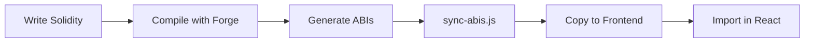

<div align="center">

# nextjs-foundry-starter

> **Aero** - Modern Web3 dApp monorepo template with Next.js 16, React 19, and Foundry smart contracts.


[What is this?](#what-is-nextjs-foundry-starter) • [Features](#key-features) • [Tech Stack](#tech-stack) • [Quick Start](#quick-start) • [How It Works](#how-it-works) • [Deployment](#deployment)

</div>

A production-ready starter for building decentralized applications with cutting-edge frontend technologies and Solidity development best practices.

---

## What is nextjs-foundry-starter?

**nextjs-foundry-starter** (codename: **Aero**) is a full-stack Web3 development template designed to eliminate setup friction and let you focus on building your dApp.

**The Problem**: Setting up a modern Web3 project involves juggling frontend frameworks, smart contract tooling, monorepo architecture, deployment configurations, and type safety. Most templates are either too minimal or overcomplicated.

**The Solution**: Aero provides a carefully architected foundation that combines:
- Latest React/Next.js features (Server Components, App Router)
- Blazing-fast Solidity development with Foundry
- Type-safe contract integration
- Production-optimized Docker builds
- Modern styling with Tailwind v4

**Best For**: Developers building Web3 applications who want a solid starting point with modern best practices baked in.

## Key Features

⚡ **Next.js 16 + React 19** - Server Components, App Router, and streaming SSR
🎨 **Tailwind CSS v4** - New @theme syntax, OKLCH colors, built-in dark mode
🔗 **Foundry Integration** - Fast Solidity compilation, testing, and ABI sync
🔐 **Web3 Ready** - Wagmi v2, RainbowKit, and Viem pre-configured
📦 **pnpm Monorepo** - Isolated dependencies with symlink efficiency
🎯 **Type-Safe Development** - End-to-end TypeScript with strict mode
🧩 **shadcn/ui Components** - Copy-paste components you own and customize
🐳 **Production Docker** - Multi-stage builds (~150MB final image)
🔒 **Code Quality Automation** - Pre-commit hooks with ESLint + Husky

## Tech Stack

| Layer | Technology | Purpose |
|-------|-----------|---------|
| **Frontend** | Next.js 16, React 19, TypeScript 5.7 | Modern React framework with Server Components |
| **Styling** | Tailwind CSS v4, shadcn/ui | Utility-first CSS with customizable components |
| **Web3** | Wagmi v2, RainbowKit, Viem | Wallet connection and contract interaction |
| **Smart Contracts** | Foundry, Solidity ^0.8.13 | Fast contract development and testing |
| **Monorepo** | pnpm workspaces | Efficient package management with symlinks |
| **Deployment** | Docker, Vercel | Production-optimized containerization |
| **Code Quality** | ESLint v9, Husky, TypeScript | Automated linting and type checking |

---

## Quick Start

### Prerequisites

- **Node.js 20+**
- **pnpm 8+**
- **Foundry** (install below)
- **Docker** (optional, for production deployment)

### Installing Foundry

Foundry is required to compile and test smart contracts:

```bash
# Install foundryup
curl -L https://foundry.paradigm.xyz | bash

# Run foundryup to install forge, cast, anvil, and chisel
foundryup

# Verify installation
forge --version
```

**Windows users:** Use Git BASH or WSL (PowerShell/CMD not supported)

### Installation

```bash
# Clone the repository
git clone <repository-url>
cd aero

# Install frontend dependencies
pnpm install

# Initialize Foundry (smart contracts)
forge init foundry --no-git
```

> **Note**: Each developer runs `forge init` locally to get the latest Foundry version.

### Development Commands

| Command | Description |
|---------|-------------|
| `pnpm dev` | Start Next.js dev server (port 3000) |
| `pnpm build:contracts` | Compile Solidity contracts |
| `pnpm sync-abis` | Copy ABIs to frontend |
| `pnpm test` | Run Forge tests |
| `pnpm anvil` | Start local Ethereum node |
| `pnpm lint` | Lint frontend code |

### Running Locally

```bash
# Start development server
pnpm dev

# Open http://localhost:3000
```

### Web3 Configuration

**Default setup**: Hardhat local network (Chain ID: 31337)

To interact with contracts:
```typescript
import { useAccount, useReadContract } from 'wagmi';
import { CONTRACT_ADDRESS } from '@/lib/config/contract';

// Read contract data
const { data } = useReadContract({
  address: CONTRACT_ADDRESS,
  abi: YourContractABI,
  functionName: 'yourFunction',
});
```

## Project Structure

```
nextjs-foundry-starter/
├── apps/
│   └── web/                    # Next.js frontend
│       ├── app/                # App Router pages
│       ├── components/ui/      # shadcn/ui components
│       └── lib/
│           ├── contracts/      # Synced ABIs (gitignored)
│           └── utils.ts        # Utilities
│
├── foundry/                    # Smart contracts (gitignored, init locally)
│   ├── src/                    # Solidity contracts
│   ├── test/                   # Forge tests
│   └── script/                 # Deployment scripts
│
├── scripts/
│   └── sync-abis.js            # ABI synchronization
│
├── docker-compose.yml
└── Dockerfile
```

## How It Works

### Contract Integration Flow



**The Complete Flow**:

1. **Write contracts** in `foundry/src/` using Solidity
2. **Compile** with `pnpm build:contracts` (Forge generates ABIs)
3. **Sync ABIs** with `pnpm sync-abis` (copies to `apps/web/lib/contracts/`)
4. **Import** in React: `import ABI from '@/lib/contracts/Counter.json'`
5. **Use with Web3** libraries (wagmi, viem, ethers - add as needed)

> **Important**: ABIs in `apps/web/lib/contracts/` are build artifacts (gitignored). Always regenerate after contract changes.

### Adding Smart Contracts

```bash
# 1. Create contract
# foundry/src/MyContract.sol

# 2. Write tests
# foundry/test/MyContract.t.sol

# 3. Compile and sync
pnpm build:contracts
pnpm sync-abis

# 4. Import in React
import MyContractABI from '@/lib/contracts/MyContract.json'
```

### UI Components with shadcn/ui

Components use a **copy-paste** approach - you own the code:

```bash
# Add new component
npx shadcn@latest add button

# Component is copied to components/ui/button.tsx
# Customize freely without library constraints

# Import and use
import { Button } from '@/components/ui/button'
```

### Styling with Tailwind v4

Tailwind v4 uses CSS-first configuration:

- Theme tokens in `app/globals.css` via `@theme` directive
- OKLCH color space for perceptual uniformity
- Dark mode with class-based `.dark` selector
- Runtime theme switching via `next-themes`

```typescript
// TypeScript path aliases
import { Button } from '@/components/ui/button'
import ABI from '@/lib/contracts/Counter.json'
```

## Deployment

### Vercel (Recommended)

Deploy with zero configuration:

1. Import your repository at [vercel.com](https://vercel.com)
2. Vercel auto-detects Next.js monorepo
3. Deploy with one click

**Automatically handled**:
- Production dependency optimization
- Automatic bundle optimization
- Global CDN distribution
- Environment variables

### Docker (VPS/Self-Hosted)

Production-optimized multi-stage build:

```bash
# Build and run
docker-compose up

# Run in background
docker-compose up -d

# View logs
docker-compose logs -f
```

**Optimizations included**:
- Multi-stage build (builder → runner)
- Next.js standalone output (~75% smaller)
- Only production dependencies in final image
- Non-root user for security
- **Final size**: ~150-200 MB (vs ~600-800 MB unoptimized)

> **Development**: Use `pnpm dev` locally (not Docker). Docker adds unnecessary overhead for local development.

## Troubleshooting

<details>
<summary><strong>ABIs not found in frontend</strong></summary>

**Problem**: Import errors for contract ABIs

**Solution**: ABIs are build artifacts (gitignored). Generate them:
```bash
pnpm sync-abis
```
</details>

<details>
<summary><strong>Docker image too large</strong></summary>

**Problem**: Final image > 500 MB

**Solution**:
1. Verify `output: 'standalone'` is in `next.config.mjs`
2. Rebuild without cache:
```bash
docker-compose build --no-cache
docker-compose up
```

**Expected size**: ~150-200 MB
</details>

<details>
<summary><strong>Pre-commit hook failing</strong></summary>

**Problem**: Git commit blocked by linter

**Solution**: Fix ESLint errors:
```bash
pnpm lint
# Or auto-fix
pnpm --filter web eslint --fix "**/*.{ts,tsx}"
```
</details>

<details>
<summary><strong>Forge command not found</strong></summary>

**Problem**: `forge: command not found`

**Solution**: Install Foundry:
```bash
curl -L https://foundry.paradigm.xyz | bash
foundryup
```
</details>

## What's Next?

**nextjs-foundry-starter** is a solid foundation for building Web3 applications. We're continuously improving the template with new features, optimizations, and best practices as the ecosystem evolves.

Feel free to customize it for your needs and contribute back to the community.

## Resources

- [Next.js Documentation](https://nextjs.org/docs)
- [Foundry Book](https://book.getfoundry.sh/)
- [Tailwind CSS v4](https://tailwindcss.com/docs)
- [shadcn/ui](https://ui.shadcn.com/)
- [pnpm Documentation](https://pnpm.io/)

## License

[MIT](LICENSE)

---

<div align="center">

**Built with modern tools for modern Web3 development**

[Report Bug](https://github.com/yourusername/nextjs-foundry-starter/issues) · [Request Feature](https://github.com/yourusername/nextjs-foundry-starter/issues)

</div>
