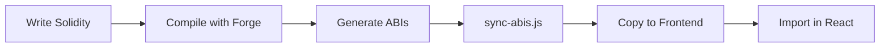

# Aero

> Modern Web3 dApp monorepo template with Next.js 16, React 19, and Foundry smart contracts.

A production-ready starter for building decentralized applications with the latest frontend technologies and Solidity development best practices.

---

## Features

- **Next.js 16** with React 19 and App Router
- **Tailwind CSS v4** with dark mode and OKLCH color system
- **Foundry** for blazing-fast smart contract development
- **TypeScript** end-to-end with strict type safety
- **shadcn/ui** component library (New York style)
- **pnpm workspaces** monorepo architecture
- **Docker** production-ready containerization
- **Husky + lint-staged** for automated code quality

---

## Tech Stack

### Frontend
| Technology | Version | Purpose |
|------------|---------|---------|
| Next.js | 16.0.10 | React framework with App Router |
| React | 19.2.1 | UI library with Server Components |
| TypeScript | 5.7.3 | Type-safe JavaScript |
| Tailwind CSS | v4 | Utility-first CSS framework |
| shadcn/ui | Latest | Customizable component library |

### Smart Contracts
| Technology | Version | Purpose |
|------------|---------|---------|
| Foundry | Latest | Smart contract development toolkit |
| Solidity | ^0.8.13 | Contract programming language |
| Forge | Latest | Testing framework |
| Anvil | Latest | Local Ethereum node |

### Development Tools
| Tool | Purpose |
|------|---------|
| pnpm | Fast, efficient package manager |
| Husky | Git hooks automation |
| ESLint v9 | Code linting with flat config |
| Docker | Containerized development |

---

## Quick Start

### Prerequisites

- Node.js 20+
- pnpm 8+
- Docker (optional, for containerized development)

### Installing Foundry

Foundry is required to compile and test smart contracts:

```bash
# Install foundryup
curl -L https://foundry.paradigm.xyz | bash

# Run foundryup to install forge, cast, anvil, and chisel
foundryup
```

**Windows users:** Use Git BASH or WSL (PowerShell/CMD not supported)

**Verify installation:**
```bash
forge --version
# Should show: forge 0.x.x (...)
```

### Installation

```bash
# 1. Clone the repository
git clone <repository-url>
cd aero

# 2. Install frontend dependencies
pnpm install

# 3. Initialize Foundry (smart contracts)
forge init foundry --no-git
```

> **Note**: Each developer runs `forge init` locally to get the latest Foundry setup. This ensures everyone uses the most recent version.

### Development

```bash
# Start Next.js development server
pnpm dev

# Compile smart contracts
pnpm build:contracts

# Run contract tests
pnpm test

# Sync ABIs to frontend
pnpm sync-abis

# Start local Ethereum node
pnpm anvil
```

### Production Deployment (Docker)

```bash
# Build and run production image
docker-compose up

# Or manually
docker build -t aero .
docker run -p 3000:3000 aero
```

> **Note**: For development, just use `pnpm dev` locally (no Docker needed)

---

## Project Structure

```
aero/
├── apps/
│   └── web/                    # Next.js frontend application
│       ├── app/                # App Router pages
│       ├── components/ui/      # shadcn/ui components
│       ├── lib/                # Utilities and contracts
│       └── public/             # Static assets
│
├── foundry/                    # Smart contract workspace
│   ├── src/                    # Solidity contracts
│   ├── test/                   # Forge tests
│   ├── script/                 # Deployment scripts
│   └── lib/                    # Contract dependencies
│
├── scripts/                    # Build and utility scripts
│   └── sync-abis.js            # ABI synchronization
│
├── docker-compose.yml          # Production deployment
├── Dockerfile                  # Production container
└── Makefile                    # Alternative CLI commands
```

---

## Available Commands

### pnpm Scripts

| Command | Description |
|---------|-------------|
| `pnpm dev` | Start Next.js dev server on port 3000 |
| `pnpm build` | Build contracts and web application |
| `pnpm build:contracts` | Compile Solidity contracts |
| `pnpm build:web` | Build Next.js for production |
| `pnpm test` | Run Forge tests with verbose output |
| `pnpm anvil` | Start local Ethereum node |
| `pnpm sync-abis` | Copy ABIs from contracts to frontend |
| `pnpm lint` | Lint frontend code |
| `pnpm type-check` | Run TypeScript type checking |

### Makefile Commands

```bash
make dev          # Start development
make build        # Build contracts
make test         # Run tests
make sync-abis    # Sync ABIs
make clean        # Clean build artifacts
make help         # Show all commands
```

---

## Architecture

### Contract Integration Flow



1. Write contracts in `foundry/src/`
2. Compile: `pnpm build:contracts`
3. Sync: `pnpm sync-abis`
4. Import: `import ABI from '@/lib/contracts/Contract.json'`

> **Note**: ABIs in `apps/web/lib/contracts/` are build artifacts (gitignored). Always regenerate after contract changes.

### UI Component Pattern

Components use **shadcn/ui** copy-paste approach:

```bash
# Add new component
npx shadcn@latest add [component-name]

# Component is copied to components/ui/ (you own it)
# Customize freely without library constraints
```

### Styling Approach

Tailwind v4 uses CSS-first configuration:

- Theme tokens in `app/globals.css` via `@theme` directive
- OKLCH color space for perceptual uniformity
- Dark mode with class-based `.dark` selector
- Runtime theme switching via `next-themes`

---

## Development Workflow

### Adding a Smart Contract

```bash
# 1. Create contract
foundry/src/MyContract.sol

# 2. Write tests
foundry/test/MyContract.t.sol

# 3. Compile
pnpm build:contracts

# 4. Sync to frontend
pnpm sync-abis

# 5. Import in React
import MyContractABI from '@/lib/contracts/MyContract.json'
```

### Adding UI Components

```bash
# Add component via CLI
npx shadcn@latest add button

# Component appears in:
apps/web/components/ui/button.tsx

# Import and use:
import { Button } from '@/components/ui/button'
```

### Testing Contracts

```bash
# Run all tests
pnpm test

# Run specific test
cd foundry && forge test --match-test testFuzz_SetNumber

# Run with gas report
cd foundry && forge test --gas-report

# Run with verbose output
cd foundry && forge test -vvvv
```

---

## Configuration

### TypeScript Path Aliases

```typescript
// Use @/* to import from apps/web/
import { Button } from '@/components/ui/button'
import utils from '@/lib/utils'
import ABI from '@/lib/contracts/Counter.json'
```

### pnpm Workspace

```yaml
# pnpm-workspace.yaml
packages:
  - 'apps/**'
```

```ini
# .npmrc
# Uses default isolated mode (symlinks)
# Next.js standalone handles Docker compatibility automatically
```

### Git Hooks

Pre-commit automatically runs:
- ESLint on changed TypeScript files
- Auto-fix where possible
- Blocks commit on unfixable errors

---

## Production Deployment

### Vercel (Recommended)

Vercel detecta automáticamente Next.js y optimiza el build:

1. Importa tu repositorio en [vercel.com](https://vercel.com)
2. Vercel detecta el monorepo automáticamente
3. Deploy con un click

**No necesitas configuración adicional.** Vercel:
- Instala solo production dependencies
- Optimiza el bundle automáticamente
- Genera build estático cuando es posible
- CDN global incluido

### Docker (VPS/Self-Hosted)

Para desplegar en tu propio servidor usando Docker:

```bash
# Build y run
docker-compose up

# O manualmente
docker build -t aero .
docker run -p 3000:3000 aero

# Background
docker-compose up -d

# Ver logs
docker-compose logs -f
```

**Optimizaciones incluidas**:
- Multi-stage build (builder → runner)
- Next.js standalone output (~75% más pequeño)
- Solo production dependencies en imagen final
- Usuario no-root (nextjs:nodejs) para seguridad
- Tamaño final: ~150-200 MB vs ~600-800 MB sin optimizar
- **Compatibilidad con pnpm symlinks**: Next.js standalone resuelve automáticamente los symlinks de pnpm durante el build, creando una estructura sin symlinks lista para Docker

### Development

**No uses Docker para desarrollo**. Usa el entorno nativo:

```bash
pnpm dev  # Hot reload, debugging, mejor DX
```

**¿Por qué?**
- Docker en dev es más lento
- Complica el debugging
- Hot reload menos confiable
- Overhead innecesario

---

## Contributing

### Code Quality

This project enforces code quality through:

- **ESLint v9**: Flat config with Next.js rules
- **TypeScript**: Strict mode enabled
- **Husky**: Pre-commit hooks
- **lint-staged**: Incremental linting

### Development Guidelines

1. Follow TypeScript strict mode
2. Use shadcn/ui components for consistency
3. Write tests for all smart contracts
4. Sync ABIs after contract changes
5. Keep components small and focused

---

## Production Optimizations

### Dependency Management

Dependencies are correctly classified for optimal production builds:

**Production Dependencies (10 packages)**:
- Runtime essentials: `next`, `react`, `react-dom`
- UI components: `@radix-ui/*`, `lucide-react`
- Runtime utilities: `tailwind-merge`, `clsx`, `class-variance-authority`
- Theme management: `next-themes`

**Development Dependencies (7 packages)**:
- Build tools: `typescript`, `tailwindcss`, `@tailwindcss/postcss`
- Code quality: `eslint`, `eslint-config-next`
- Type definitions: `@types/node`, `@types/react`

**Why this matters**:
- Vercel/Docker only install production deps in final build
- ~40% reduction in deployment size
- Faster installs and cold starts
- Smaller bundle sizes

**pnpm Configuration**:
- Uses default `isolated` mode with symlinks for strict dependency management
- No phantom dependencies: can only import packages declared in `package.json`
- Next.js `standalone` output automatically resolves symlinks for Docker compatibility
- Faster installs with content-addressable store and hard links

### Multi-Stage Docker Build

```dockerfile
Stage 1 (Builder):
  - Installs ALL dependencies with pnpm (isolated mode, uses symlinks)
  - Compiles TypeScript → JavaScript
  - Builds Next.js standalone (resolves symlinks, copies real files)
  - ~800 MB (discarded after build)

Stage 2 (Runner):
  - Copies only standalone build (already symlink-free)
  - Only production dependencies needed at runtime
  - Non-root user (security)
  - ~150-200 MB (75% reduction)
```

### What Gets Deployed

**Included in production**:
- Compiled JavaScript (from TypeScript)
- Static CSS (from Tailwind)
- Production node_modules
- Public assets
- Next.js runtime

**NOT included (build-time only)**:
- TypeScript compiler
- ESLint and configs
- Tailwind compiler
- Source `.tsx` files
- devDependencies

---

## What's Included

### Implemented

- ✅ Complete monorepo structure
- ✅ Next.js 16 with React 19 and TypeScript
- ✅ Tailwind v4 with dark mode
- ✅ shadcn/ui component library
- ✅ Foundry smart contract environment
- ✅ Example Counter contract with tests
- ✅ ABI synchronization pipeline
- ✅ Production-optimized Docker (multi-stage)
- ✅ Optimized dependency classification
- ✅ Git hooks for code quality

### Roadmap

- [ ] Web3 wallet integration (wagmi/viem)
- [ ] Contract interaction hooks
- [ ] Environment variable templates
- [ ] CI/CD pipeline
- [ ] Frontend testing framework
- [ ] Vercel deployment guide

---

## Troubleshooting

<details>
<summary><strong>Docker build fails or image is too large</strong></summary>

**Problem**: Build fails or final image is > 500 MB

**Solution**:
1. Verify `output: 'standalone'` is in `next.config.mjs`
2. Rebuild without cache:
```bash
docker-compose build --no-cache
docker system prune -a  # Remove old images
docker-compose up
```

**Expected final image size**: ~150-200 MB
</details>

<details>
<summary><strong>Vercel build fails with dependency errors</strong></summary>

**Problem**: Vercel can't find certain packages

**Solution**: Check if dependencies are correctly classified:
```bash
# View current setup
node -e "const p=require('./apps/web/package.json'); console.log('Prod:',Object.keys(p.dependencies).length,'Dev:',Object.keys(p.devDependencies).length)"

# Should show: Prod: 10 Dev: 7
```

Runtime packages should be in `dependencies`, build tools in `devDependencies`.
</details>

<details>
<summary><strong>ABIs not found in frontend</strong></summary>

**Problem**: Import errors for contract ABIs

**Solution**: ABIs are build artifacts (gitignored). Generate them:
```bash
pnpm sync-abis
```

This compiles contracts and copies ABIs to `apps/web/lib/contracts/`
</details>

<details>
<summary><strong>Docker container exits immediately</strong></summary>

**Problem**: Container starts then stops with exit code 0 or 1

**Solution**: Check if `server.js` path is correct:
```bash
# Verify standalone structure
docker run --rm aero ls -la apps/web/

# Should show: server.js
```

If missing, rebuild with `docker-compose build --no-cache`
</details>

<details>
<summary><strong>Pre-commit hook failing</strong></summary>

**Problem**: Git commit blocked by linter

**Solution**: Fix ESLint errors:
```bash
pnpm lint
# Or auto-fix
pnpm --filter web eslint --fix "**/*.{ts,tsx}"
```
</details>

---

## License

[MIT](LICENSE)

---

## Resources

- [Next.js Documentation](https://nextjs.org/docs)
- [Foundry Book](https://book.getfoundry.sh/)
- [Tailwind CSS v4](https://tailwindcss.com/docs)
- [shadcn/ui](https://ui.shadcn.com/)
- [pnpm Documentation](https://pnpm.io/)

---

<div align="center">

**Built with modern tools for modern Web3 development**

[Report Bug](https://github.com/yourusername/aero/issues) · [Request Feature](https://github.com/yourusername/aero/issues)

</div>